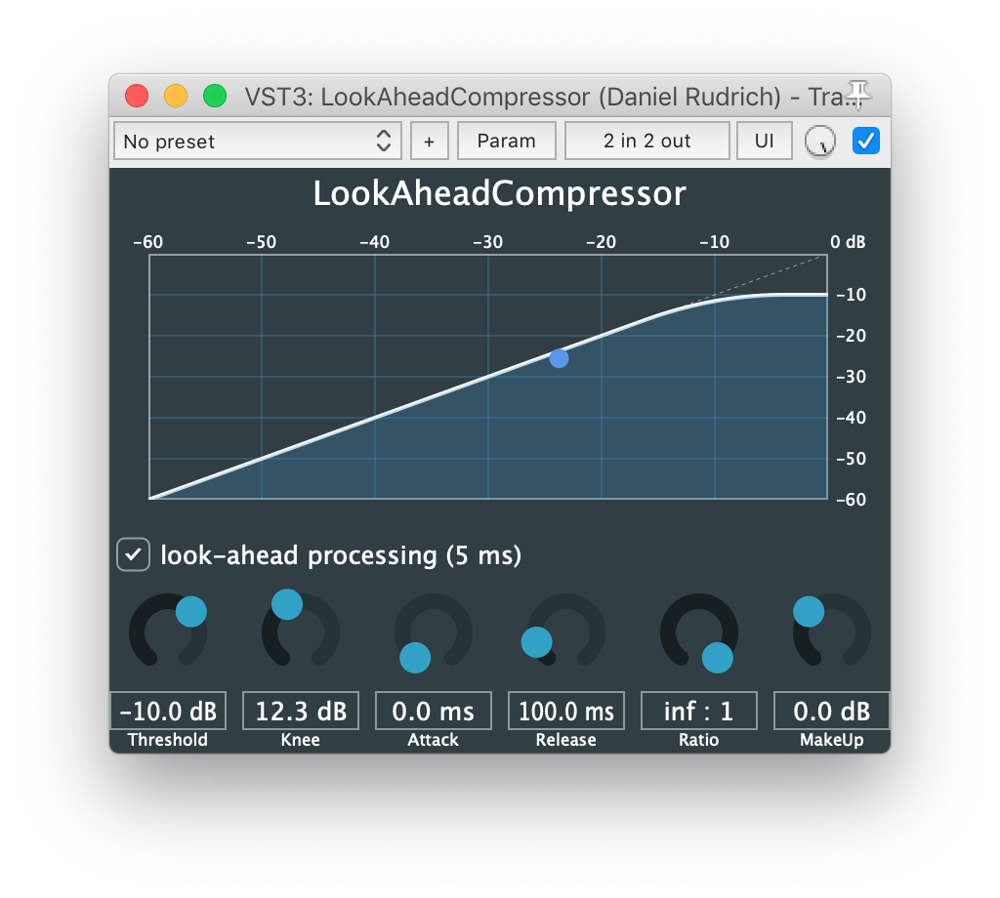

# SimpleCompressor
Code and theory of a look-ahead compressor/limiter.

### Purpose
The purpose of this project to demonstrate and describe, how a look-ahead limiter works and how to implement it.
About 95%1 of all the sources (books, internet articles and forum threads) recommend a very easy way to implement the look-ahead feature, but unfortunately, 100%2 of those applications will lose their ability to limit the signal's level.

With this, I want to shed a little light on the **mystery of look-ahead limiters** :wink:

### What's in the box?
This repository includes:
- C++ classes
  - computation of the gain reduction from a given side-chain signal
  - look-ahead processing of the gain reduction samples
- JUCE class: a compressor class which wraps the gain reduction class into a JUCE audio processor
- JUCE example projects
  - SimpleCompressor: making use of the wrapper, implementing a compressor without look-ahead
  - LookAheadCompressor: compressor / limiter with look-ahead feature
- thirdpary classes for multi-channel samples-delays and visualization of the compressor characteristic
- a tutorial: *How to implement look-ahead limiters*

### References
The compressor class is mainly based on this presentation:
http://c4dm.eecs.qmul.ac.uk/audioengineering/compressors/documents/Reiss-Tutorialondynamicrangecompression.pdf

The sample delay class is taken from the IEM Plug-in Suite
https://plugins.iem.at
https://git.iem.at/audioplugins/IEMPluginSuite

### Screenshot of the LookAheadCompressor plug-in

###### 1 not based on scientific data, but estimted rather subjectively.
###### 2 yeah, all of them.
