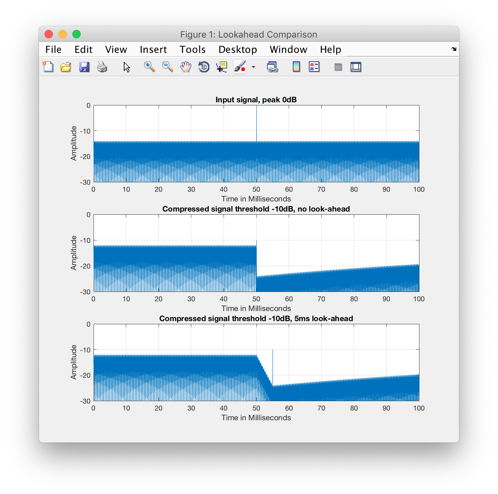
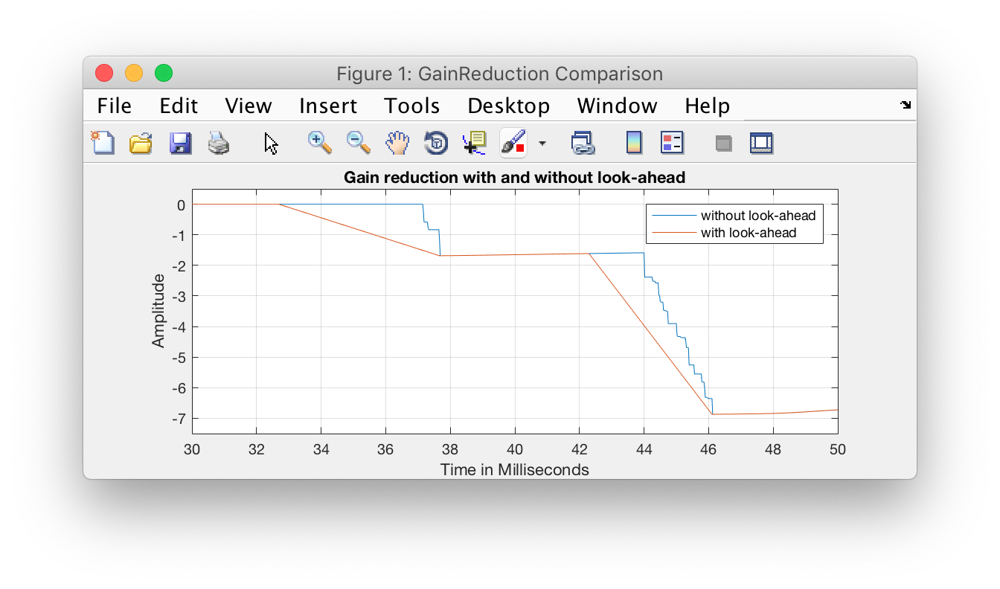

# LookAhead Limiters

This article describes why we need look-ahead in limiter implementations, how look-ahead is implemented the wrong way, and how to implement it right.

### Problem: Limiters without look-ahead
The purpose of a limiter is to limit the level of an incoming signal. So a limiter which is set to -10dB should attenuate an incoming signal in a way, that no sample is above that threshold at the output. 

The easiest way to do this, is to use a compressor, set the attack time to zero and the ratio to infinity. The zero-attack-time makes sure, that we don't miss the transients of a sound, and the infinity ratio makes sure that the signal is attenuation exactly by the amount it exceeds the threshold.

This kind of limiter is also called brickwall-limiter. And similar to a transistor guitar amp, it sounds terrible if you drive it too much. Let's assume the input signal is a sine-wave with an amplitude of 1 which equals 0dB. If we send it through a brickwall-limiter with threshold -10dB (which is 0.3162), each sample of the sine-wave which exceeds +/- 0.3162 is clipped at exactly that value. The result is no-sine wave anymore, and it will sound very much distorted. 

So how can we get rid of this distortion? Answer: **look-ahead**

### Solution? Delaying the input signal
Many books and internet posts suggest to simply delay the input signal and you'll get look-ahead. Yea... that's **not** how look-ahead works, sorry.

What would happen, if we implement look-ahead that way? Let's assume we have a constant sine-wave at about -15dB, and in between we have one single pulse with 0dB (value of 1). If we send it to our brick-wall limiter, the gain reduction at the time point of that impulse, will be -10dB, as it's not allowed to exceed the -10dB threshold. If we now delay the input signal before we apply our gain-reduction, the -10dB attenuation will hit a certain amount of time before the impulse set's in -> we most definitely miss it. Even with a long release time, the impulse will not be attenuated by the necessary -10dB. 

You can test your implementation of a look-ahead limiter with the [sine8kWithDirac.wav  test-signal](sine8kWithDirac.wav). It's a sine wave with frequency of 8kHz at around -15dB and one dirac impulse with 0dB directly in the middle (see plots below). Set your threshold to below 0dB (otherwise the impulse doesn't has to be limited) and look at the output levels. If it exceeds your threshold, it's not working as a limiter. 

### Why even look-ahead?
The answer to this question will bring us directly to the solution! Why should look-ahead get rid of the distortion, and what exactly is look-ahead in the first place?

Our signal distorts, as our compressor/limiter is working way to fast. It basically follows the incoming audio signal. With higher release times, we can get rid of it, but the first time a high level hit's our limiter, it will distort. So the problem is the fast attack time, which clips our transients. 

If only we could reduce the gain a little bit right before the transients, so the attack phase wouldn't be so brutal. So in the best scenario, we somehow get notified that a high peak is coming in soon, and we could gradually lower the level of the signal beforehand. And that's look-ahead.

### Solution: the right implementation of look-ahead
A look-ahead limiting is done in four simple steps, two of them are the same as with a regular compressor / limiter.

#### STEP 1: Computation of the gain reduction
This is done pretty much the same as with the normal compressor: create a side-chain signal, which for a limiter should be the the max over all channels, as we don't want to miss the highest peaks. Send this side-chain signal to the `GainReductionComputer` and receive your gain-reduction. It's preferable to have the attenuation in the logarithmic domain (in decibels) and without the make-up gain. There's a special method for this in the `GainReductionComputer`. 

#### STEP 2: Delaying *both* input and gain reduction signals
It’s important that both signals are delayed the same, as we don’t want to apply gains before or after the transients happen. The delay-time can be varied, 5ms are a good trade-off between latency and distortion suppression. The delay value can be rounded to samples, so there's no need for a fractional delay, just a good old sample delay. 

#### Step 3: Smoothing your gain-reduction
This is the most important step. We want to smooth (fade-in) our aggressive gain reduction values, so they won’t cause distortions. So what we want to achieve is, when a transient comes in, and let’s say we need a gain-reduction of -10dB to keep it below threshold, the gain-reduction is faded-in. Step 2 gives us a little bit of time to apply this gain-ramp (fade-in). 

The realization of that fade-in is a little bit tricky.  We have to look at our gain-reduction and add a fade-in for each peak which set's in too fast. The easiest way is to start from the most recent sample of the block (the last one) and work our way back to the first one. You can see it as a time-reverse filtering with a low-pass, however, a regular low-pass would reduce the gain of the peaks. So we have to do it by hand, sample per sample.

Take a look at the `LookAheadGainReduction` class, it fades in those critical peaks. The code is way more complicated as the `just delay the input signal`-approach, but way more effective!

#### Step 4: Apply the smooth gain-reduction
Simply multiply the input signal with the smooth gain-reduction. Et voila! 

### Comparison of look-ahead and no-look-ahead
Let's take a look at what look-ahead is doing. The following figure shows the test signal mentioned above, and the outputs of the SimpleCompressor plug-in (without look-ahead) and the LookAheadCompressor (well, with look-ahead). 

The amplitude of the sine-signal nicely shows the gain-reduction over time. In the middle plot (no look-ahead) you can see that the signal levels is the same until the impulse hits the compressor. It immediately reduces the gain by 10dB, and gradually fades back to no reduction as the release-time is set to 100ms. That abrupt change in gain-reduction will result in distortions.

The third plot shows two things: a general delay of 5ms, as the peak is shifted from 50ms to 55ms. However, when the original peak hits the limiter, it starts to gradually lower the gain. And exactly when the impulse appears, the gain reduction reached the necessary -10dB.

### Visualization of the gain-reduction fade-in
The next figure shows the gain-reduction over time for a drum onset, with and without look-ahead. The delay of the look-ahead data was compensated for visualization purposes. 

As expected, we see the linear fade (as the y-axis is logarithmic) toward the peaks. The micro-movements are overwritten by the fade, as they are steeper than the fade-curve of the local peak.

